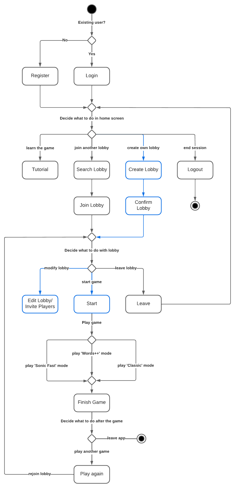

# Basically Wordle. - Frontend

Wordle PvP frontend with React and TypeScript.

# Introduction

“Basically Wordle.” is a game based on the recent trending quiz “Wordle”. The goal is to find a target word that consists of five letters. The player gets six attempts to find the word. A letter that is part of the target word gets marked yellow and if the letter matches the position, it gets marked green. To further aid the player, letters that aren’t part of the solution get marked in a darker grey.

We decided to take a multiplayer approach where users can join lobbies and play against each other. This means there are two different categories users can choose from. PvP means that players contend with each other and Solo provides a casual mode without competitive pressure that is basically the same as the original.

# Technologies

- ReactJS as the base framework (strictly speaking, a JS library)
- GraphQL
- Apollo for networking with GraphQL support
- ReduxJS for app state management
- Material UI as the main design framework
- Mantine for useful hooks and some design components
- ESLint for annoying all the devs
- TypeScript as the main programming language
- HTML, CSS as markup languages

# High-level Components

The [Home Screen](./src/pages/home.tsx) is where the user lands right after authenticating with valid credentials. It shows an overview of available lobbies and also shows the friends list for the first time.
The [Lobby](./src/pages/lobbyManagement.tsx) is where people gather to play games and where the host can setup the game parameters before launching the first round.
After initiating a game, players will see the [Game Screen](./src/pages/game.tsx) which consists of a words grid, keyboard and, depending on the mode, one or more opponent grids.
The overall React entry point is the [index.tsx](./src/index.tsx) file which mounts the app at the root "app" div defined inside the [index.html](./public/index.html) file.

# Launch & Deployment

The client requires the server (backend) to run at http://localhost:8080 in order to serve app content. The frontend will the be available at http://localhost:3000.  
You can deploy a new frontend release just by committing to a new branch, and then opening and merging a PR into the `master` branch.

## Available Scripts

In the project directory, you can run:

### `npm start`

Runs the app in the development mode.\
Open [http://localhost:3000](http://localhost:3000) to view it in the browser.

The page will reload if you make edits.\
You will also see any lint errors in the console.

### `npm test`

Launches the test runner in the interactive watch mode.\
See the section about [running tests](https://facebook.github.io/create-react-app/docs/running-tests) for more information.

### `npm run build`

Builds the app for production to the `build` folder.\
It correctly bundles React in production mode and optimizes the build for the best performance.

The build is minified and the filenames include the hashes.\
Your app is ready to be deployed!

See the section about [deployment](https://facebook.github.io/create-react-app/docs/deployment) for more information.

### `npm run eject`

**Note: this is a one-way operation. Once you `eject`, you can’t go back!**

If you aren’t satisfied with the build tool and configuration choices, you can `eject` at any time. This command will remove the single build dependency from your project.

Instead, it will copy all the configuration files and the transitive dependencies (webpack, Babel, ESLint, etc) right into your project so you have full control over them. All of the commands except `eject` will still work, but they will point to the copied scripts so you can tweak them. At this point you’re on your own.

You don’t have to ever use `eject`. The curated feature set is suitable for small and middle deployments, and you shouldn’t feel obligated to use this feature. However we understand that this tool wouldn’t be useful if you couldn’t customize it when you are ready for it.

# Illustrations!

# Roadmap

- A ranking system with scoreboards
- A chat system
- More game modes

# Authors and acknowledgement

Made by SoPraFS22 Group 9.

- Jerome Maier
- Mete Polat
- Elvio Petillo
- Matej Gurica

# License

MIT License. See [LICENSE](./LICENSE).  
The license is provisional and subject to change. All rights reserved.

## Learn More

You can learn more in the [Create React App documentation](https://facebook.github.io/create-react-app/docs/getting-started).

To learn React, check out the [React documentation](https://reactjs.org/).
